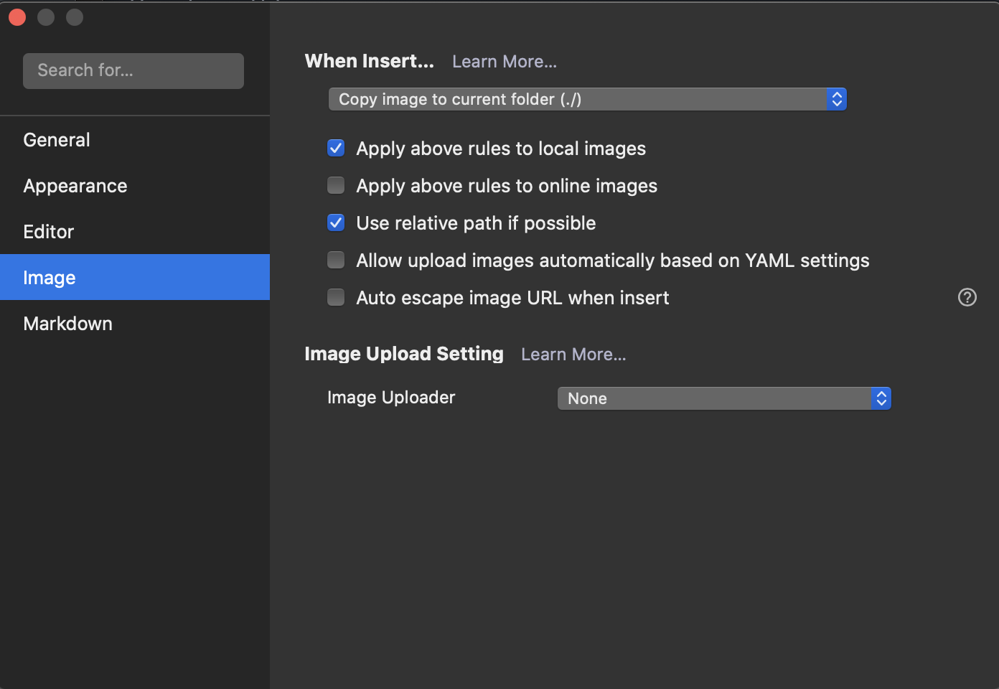

# github to s3

### 0. Editing Markdown files with Typora is recommended


### 1. Make your markdown files on ./markdown_files


### 2. Set up as following on Typora > Preferences > Image



### 3. Write stuffs on .md files on ./markdown_files

### 4. Move existing images in  ./markdown_files to  ./markdown_files/img

```python
python clean_imgs_move.py
```


### 5. Change image paths of your markdown files to image url of your S3 bucket

```python
python deploy_to_s3.py
```


## References

* [How to automate upload to S3: AWS CodePipeline](https://medium.com/@sithum/automate-static-website-deployment-from-github-to-s3-using-aws-codepipeline-16acca25ebc1)
* [Setup your AWS S3 Bucket](https://www.youtube.com/watch?v=v33Kl-Kx30o)

